<p align="center">
  
</p>

<h1 align="center">Steven Rosas</h1>

<p align="center">
  Software Engineer focused on AI systems, developer tools, backend services, and immersive web experiences.
</p>

<p align="center">
  <a href="https://srosas.netlify.app/">Portfolio</a> |
  <a href="https://srosas.netlify.app/resume">Resume</a> |
  <a href="https://www.linkedin.com/in/srosasg/">LinkedIn</a>
</p>

## What I Build

- AI-assisted systems with clear model boundaries, structured prompts, and practical evaluation loops.
- Backend and cloud-oriented software for reliable, human-centered workflows.
- Interactive web experiences that balance performance, usability, and visual polish.
- Game and immersive interface experiments that inform how I think about systems, feedback, and flow.

## Current Focus

```txt
LLM workflows      -> prompt design, structured output, evaluation
Backend systems    -> services, databases, APIs, cloud applications
Web experiences    -> TypeScript, JavaScript, responsive interfaces
Interactive tools  -> game systems, developer workflows, real-time UX
```

## Toolbox

<p>
  
  
  
  
  
  
  
  
</p>

## Featured Work

### iCare - Intelligent Healthcare for Mental and Behavioral Health

Dual-chatbot UX for behavioral health support, combining triage-style assistance and coaching-style guidance with careful prompt boundaries.

**Signals:** Python, NLP, UX, research  
**Link:** [UW research listing](https://depts.washington.edu/uwbur/listing/cocobot-natural-language-processing-nlp-for-behavioral-and-mental-health/)

### Google - Associate Software Developer Intern

Worked on LLM prompt quality, task alignment, model behavior guidance, and structured content workflows across classification, summarization, and code transformation use cases.

**Signals:** LLMs, prompting, evaluation, structured I/O  
**More:** [Resume](https://srosas.netlify.app/resume)

## Connect

I am open to internships, contract work, and conversations about AI systems, web engineering, developer tools, and interactive software.

<p>
  <a href="https://srosas.netlify.app/">Portfolio</a> |
  <a href="https://www.linkedin.com/in/srosasg/">LinkedIn</a> |
  <a href="https://github.com/DevGhosty">GitHub</a>
</p>
